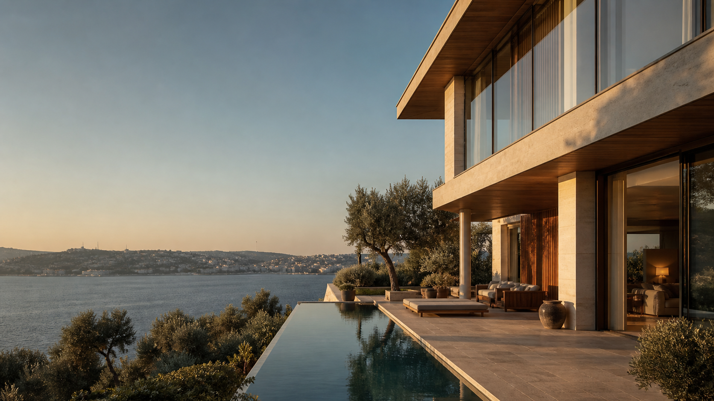

<div align="center">
  
  <h1>MIRA Estate</h1>
  <p>Seçkin yaşam alanları için tasarlanmış modern bir gayrimenkul keşif deneyimi.</p>

  <p>
    
    
    
  </p>
</div>



## Projenin hikâyesi

Bu proje, yazılım geliştirmeye başladığım dönemde oluşturduğum ilk projelerden biriydi. Aradan geçen zamanda öğrendiklerimi görmek ve eski bir fikrin doğru tasarım kararlarıyla ne kadar ileri taşınabileceğini göstermek için projeye yeniden döndüm.

Amacım yalnızca arayüzü daha güzel göstermek değildi. İlk sürümü; güçlü bir görsel kimliğe, daha iyi bir kullanıcı deneyimine ve gerçek bir ürün hissi veren etkileşimlere sahip modern bir Angular uygulamasına dönüştürmek istedim.

Sonuç olarak ortaya; editoryal tasarım dilini, işlevsel emlak araçlarıyla birleştiren **MIRA Estate** çıktı.

## Neler değişti?

- Baştan tasarlanan responsive kullanıcı arayüzü
- Tutarlı renk, tipografi, boşluk ve bileşen sistemi
- Masaüstü ve mobil cihazlara uyumlu navigasyon
- Gerçek bir ürün deneyimi sunan favori ve karşılaştırma akışları
- Etkileşimli kredi hesaplama aracı
- Mülk detay sayfaları ve tam ekran fotoğraf galerisi
- Arama, şehir seçimi ve mülk türü filtreleme
- Yerel depolama sayesinde kalıcı kullanıcı seçimleri
- Erişilebilir klavye odağı ve azaltılmış hareket desteği

## Öne çıkan özellikler

### Favoriler

Beğenilen mülkler kişisel seçkiye eklenebilir. Favoriler tarayıcıda saklanır ve sayfa yenilendiğinde korunur.

### Karşılaştırma

En fazla üç mülk; fiyat, konum, yaşam alanı, oda sayısı ve mülk tipi gibi önemli bilgiler üzerinden yan yana karşılaştırılabilir.

### Kredi hesaplama

Ev fiyatı, peşinat, vade ve aylık faiz oranı değiştirildiğinde tahmini aylık ödeme anında yeniden hesaplanır.

### Detay ve fotoğraf galerisi

Her mülkün kendine ait detay sayfası, fotoğraf seçimi ve tam ekran galeri deneyimi bulunur.

## Tasarım yaklaşımı

MIRA'nın görsel dili, gayrimenkul sektöründe güven ve seçkinlik hissi oluşturacak renk teorisi üzerine kuruldu:

| Renk | Kod | Kullanım amacı |
| --- | --- | --- |
| Koyu yeşil | `#12372F` | Güven, kalıcılık ve premium marka hissi |
| Sıcak fildişi | `#F4F0E7` | Ferahlık ve mimari görseller için sakin zemin |
| Terracotta | `#B96240` | Karar ve aksiyon noktalarında kontrollü vurgu |
| Adaçayı | `#7F9188` | İkincil metinler ve yumuşak geçişler |
| Şampanya | `#D8CBB7` | Sınırlar ve ince detaylar |

Başlıklarda **Cormorant Garamond**, arayüz ve içerik metinlerinde **Manrope** kullanıldı. Gayrimenkul görselleri proje için özel olarak üretildi ve uygulamanın kendi dosyaları içerisinde tutuluyor.

## Kullanılan teknolojiler

- Angular 19
- TypeScript 5.7
- Angular Router ve standalone component yapısı
- Angular Signals
- Phosphor Icons
- Component bazlı responsive CSS
- Local Storage

## Projeyi çalıştırma

Projeyi klonladıktan sonra ana dizinde aşağıdaki komutları çalıştırın:

```bash
npm run setup
npm start
```

Uygulama [http://localhost:4200](http://localhost:4200) adresinde açılır.

Production çıktısı oluşturmak için:

```bash
npm run build
```

Derlenen dosyalar `first-app_01-hello-world/dist/first-app` dizinine yazılır.

## Proje yapısı

```text
real-estate-website/
├── first-app_01-hello-world/
│   ├── src/app/       # Sayfalar, bileşenler, servisler ve yönlendirme
│   ├── src/assets/    # Marka ve gayrimenkul görselleri
│   └── src/styles.css # Global tasarım değişkenleri
├── package.json       # Kök çalışma komutları
└── README.md
```

## Sonraki adımlar

- Gerçek ilan API'si veya yönetim paneli entegrasyonu
- Harita üzerinde konum bazlı arama
- Kullanıcı hesabı ve bulut tabanlı favoriler
- Gelişmiş filtreleme ve sıralama
- Canlı yayınlama ve performans ölçümü

> Bazen gelişimi görmenin en iyi yolu, başladığın yere geri dönüp onu bugün bildiklerinle yeniden inşa etmektir.

---

<div align="center">
  Öğrenmek, geliştirmek ve ilk projeme hak ettiği ikinci şansı vermek için tasarlandı.
</div>
